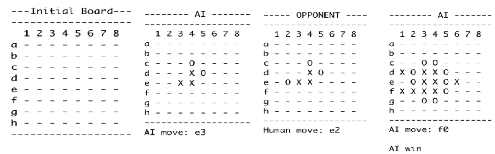
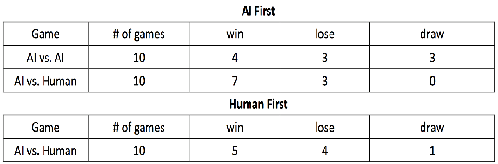

# Artificial Intelligence Game: 4-in-a-line

The AI Game: 4-in-a-line is a combination of the popular games Connect Four and tic-tac-toe. We start with an 8x8 board, players take turns placing a piece on any grid. First player to get 4 in a line (either a row, or a column; diagonals are NOT counted) wins. The amount of time allowed for generating the next move is 5 seconds.

## Algorithms Implemented

### Minimax Algorithm with Alpha-Beta Pruning
The Minimax algorithm is a recursive algorithm used in decision-making and game theory. It provides an optimal move for the player assuming that the opponent is also playing optimally. Alpha-beta pruning is used to enhance the Minimax algorithm by reducing the number of nodes evaluated, thus improving efficiency. The algorithm evaluates potential moves up to a specified depth and selects the move that maximizes the AI's advantage while minimizing the opponent's advantage.

### Pre-Random Moves
To make the game more challenging and varied, the AI uses predefined random moves for the initial few moves. This adds unpredictability to the AI's strategy, making it more engaging for the player.

## Project Structure

- `board.py`: Contains the Board class, which handles the game board and related operations such as generating successors, checking goal states, and printing the board.
- `minimax.py`: Contains the MiniMaxAgent class, which implements the Minimax algorithm with alpha-beta pruning.
- `random_move.py`: Contains the PreRandomMove class, which provides initial random moves for the AI.
- `score_point.py`: Contains the PointScore class, which evaluates board states to guide the AI's decisions.
- `main.py`: Contains the Main class, which orchestrates the game flow and handles user interaction.

## Approach

### a. Start the program
- The program will ask the user for giving the time limit and the depth for the minimax algorithm with alpha-beta pruning.
- The user can decide who go first, Computer (AI) or Opponent (Human).

## Evaluation Function
The evaluation function consider all the cases include:

### a. How many pieces in line
- Line of two: _ XX _, XX _, _XX, _X_X_, X_X_, _X_X, ...
- Line of three: _ XXX _, XXX _, _XXX, _X_XX_, XX_X_, _X_XX, ...
- Line of four: Winning case.

### b. How many block ( red part )
- Block one:
- Meet the limit of the board: _XXX|
- Meet the opponent: _XXO
- Block two: O_XXX|, O_XXXO, OXX_X|, ...

### c. Location of empty space ( yellow part )
- No empty space: XXX, _XXX, _XXX_, ...
- Empty space at position [1]: X_XX, _X_XXX, ...
- Empty space at position [2]: XX_X, _XX_XX, ...
- Empty space at position [3]: XXX_X, _XXX_X, ...

### d. Decide the value
Decide the value for each cases depend on the situation list above. Keep changing the value for each cases to see which value works better in the games.

## Implementation Analysis

### Minimax Algorithm with Alpha-Beta Pruning
- **Success Rate**: The AI performs optimally based on the evaluation function and search depth.
- **Efficiency**: Alpha-beta pruning significantly reduces the number of nodes evaluated, enhancing the performance of the Minimax algorithm.

### Pre-Random Moves
- **Variation**: Initial random moves add variety to the AI's strategy, making the game more engaging.
- **Unpredictability**: The randomness of the initial moves ensures that the AI does not follow the same pattern every game.

## Game Process (several steps example, not continual steps)



## Self Test




## How to Compile and Run the Code

### Prerequisites
- Python 3.x

### Instructions

1. Clone the repository or download the source code.
2. Ensure that the following files are present in the same directory:
   - `board.py`
   - `minimax.py`
   - `random_move.py`
   - `score_point.py`
   - `main.py`

3. Open a terminal and navigate to the directory containing the files.
4. Run the following command to execute the program:
   ```sh
   python main.py
